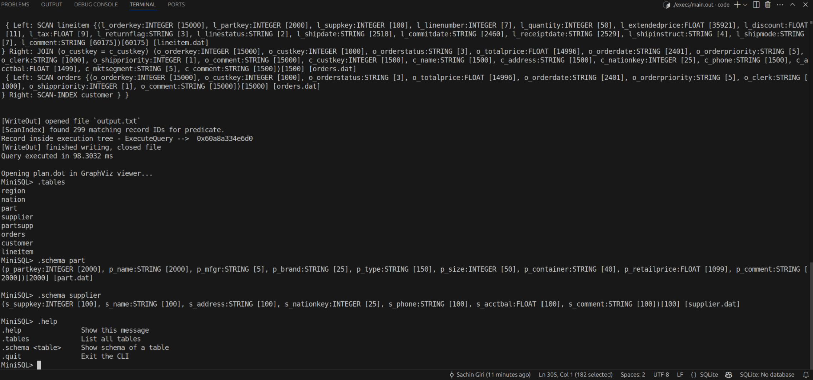
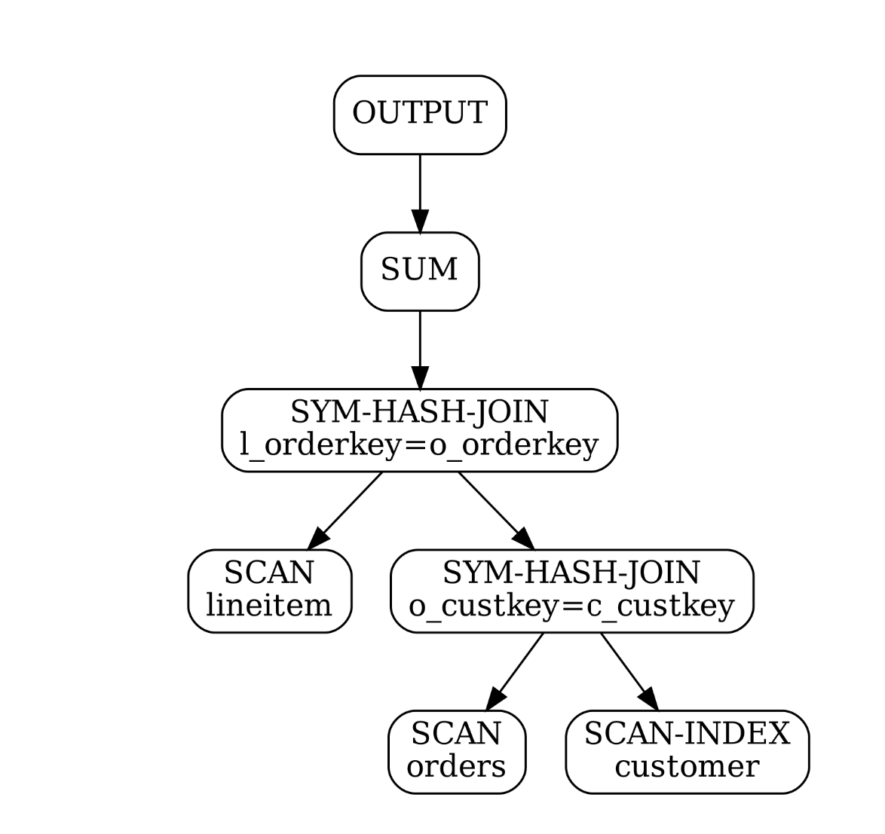
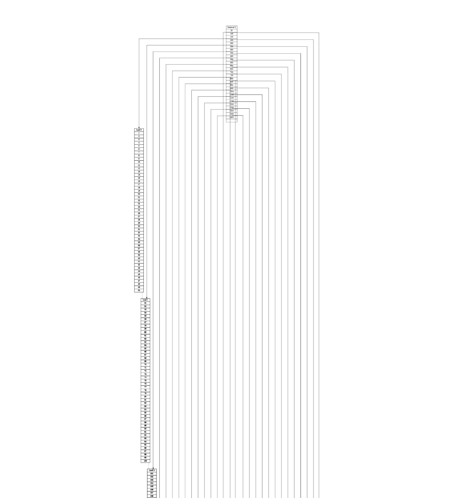

# 📦 MiniSQL — Database System Implementation in C++

> 🧠 *A full-fledged relational database engine from scratch*  
> 📘 Inspired by: _Database Systems: The Complete Book_ by Garcia-Molina, Ullman, Widom

---

## 📝 Overview

**MiniSQL** is a complete educational database system implemented entirely in C++, developed over the period of 5 months, graduate semester long project. It simulates the core internals of a relational database engine, including query parsing, compilation, relational algebra execution, indexing via B+ Trees, and binary-level storage.

This project was developed in multiple phases, each representing a major subsystem of a real-world DBMS. From catalog management to join algorithms, from scan and filter operations to query plan visualization — everything was built by hand, with a focus on learning and adhering to theory from foundational texts.

---

## ✨ Features

✅ Custom SQL-like parser using Flex/Bison  
✅ Execution of relational algebra operations: Scan, Select, Join, Project, Aggregate, GroupBy, Duplicate Removal  
✅ Join algorithms implemented:
- Nested-Loop Join
- Hash Join
- Symmetric Hash Join

✅ Custom-built B+ Tree Indexing (with disk persistence and binary serialization)  
✅ File-based table storage using custom heap files (`.dat` format)  
✅ Metadata stored via lightweight SQLite-backed catalog  
✅ Graphviz-based **query plan visualizer**  
✅ Interactive shell with support for:
- `.help`
- `.tables`
- `.schema`
- `.quit`
✅ One-command build system via Makefile

---


### 🖥️ CLI in Action
> _Example of entering a query and getting tabular output + plan summary_  



---

### 🧠 Query Plan Visualization (Graphviz)
> _Exported DOT graph rendered for a join query_  



---

### 📦 B+ Tree Structure (Create Index)
> _Shows the tree building from insertions during index creation_  



---

### 🧮 Disk-backed Heap File (Visual Debug)
> _Illustrating table storage in tpc-h data_  


---

## 🗂️ Project Structure

```{verbatim}
MiniSQL/
├── code/
│   ├── headers/              # All header files (Schema.h, Catalog.h, DBFile.h, etc.)
│   ├── source/               # All source files (RelOp.cc, File.cc, QueryCompiler.cc, etc.)
│   ├── project/              # Phase entry points (e.g., test-phase-1.cc, main.cc)
│   ├── execs/                # Output binaries (e.g., main.out, test-phase-*.out)
│   └── makefile              # Master Makefile for compilation
├── data/
│   ├── *.tbl                 # TPC-H formatted raw data files
│   └── *.schema              # Optional schema descriptors
├── catalog.sqlite            # SQLite-backed metadata catalog
├── Dockerfile                # 🐳 (optional) Docker container setup
├── screenshots/              # Folder for screenshots (for README)
└── README.md                 # 📘 This file
```


---

## ⚙️ Build & Run

### 📥 Requirements

- Linux (or WSL/macOS)
- `g++`, `make`, `flex`, `bison`, `sqlite3`, `libsqlite3-dev`, `graphviz`

### 🛠️ Compile

```bash
cd code
make init
make all
```

💻 Start the CLI
```bash
./execs/main.out
```

🧪 Sample SQL Queries

-- 1. Simple selection
```bash
SELECT * FROM nation WHERE n_regionkey = 1;
```
-- 2. Join with filter
```bash
SELECT c.c_name, o.o_orderkey 
FROM customer c, orders o 
WHERE c.c_custkey = o.o_custkey AND c.c_name = 'Customer#000000011';
```
-- 3. Aggregate with GROUP BY
```bash
SELECT c_nationkey, SUM(c_acctbal) 
FROM customer 
GROUP BY c_nationkey;
```
-- 4. Create Index
```bash
CREATE INDEX idx_cname ON customer(c_name);
```

💡 After creating an index, MiniSQL will automatically use it for eligible queries via ScanIndex.

🕹️ CLI Commands

| Command   | Description             |
| --------- | ----------------------- |
| `.help`   | List available commands |
| `.tables` | Show all tables         |
| `.schema` | Show schema of a table  |
| `.quit`   | Exit the CLI            |

Each SQL query must end with a semicolon ;. Multi-line queries are supported.

📚 References
📘 Database Systems: The Complete Book, 2nd ed. — Garcia-Molina, Ullman, Widom

🧪 TPC-H Benchmark data

🧰 SQLite3 (for catalog metadata)

🧠 Graphviz (for query plan visualizations)

🙏 Acknowledgments

This project is the result of deep effort and iterative implementation over an entire semester. Grateful thanks to:

🧑‍🏫 Course instructors & TAs for the structure and feedback

🧠 The authors of the database textbook that made concepts click

🧰 Tools like SQLite, Graphviz, and Flex/Bison

🙌 Everyone who reviewed my code, debugged with me, or supported this journey

🎯 Conclusion
Building a database engine from scratch is one of the most enlightening journeys in systems programming and data engineering. This project taught me how the database engines we use daily are engineered layer by layer — from bit-level file management to high-level SQL interpretation.

This project is now a powerful sandbox for exploring ideas like query optimization, indexing strategies, and operator design.


Made with ❤️, C++, and coffee.
Happy querying! ☕


